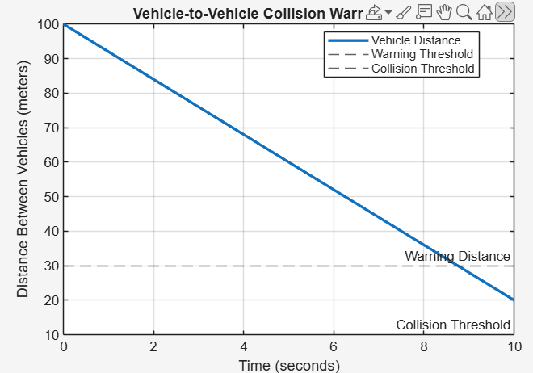

# Vehicle-to-Vehicle Collision Warning System using MATLAB

## Overview

This project demonstrates a MATLAB-based vehicle-to-vehicle collision warning system.

The system monitors the distance between two vehicles and uses predefined distance thresholds to identify situations where a warning or collision alert is required.

## Features

- Vehicle distance monitoring
- Relative speed-based distance calculation
- Warning threshold detection
- Collision threshold detection
- MATLAB simulation
- Graphical representation of vehicle distance
- Console-based warning messages

## Working

The simulation starts with an initial distance of 100 meters between two vehicles.

The relative speed is set to 8 m/s, and the distance between the vehicles is calculated over time.

Two thresholds are used:

- **Warning Distance:** 30 meters
- **Collision Threshold:** 10 meters

When the distance falls below the warning threshold, the system generates a warning.

When the distance falls below the collision threshold, the system generates a danger message indicating a collision risk.

## Project Files

| File | Description |
|------|-------------|
| `collision_warning.m` | MATLAB simulation code |
| `collision_warning_result.png` | Simulation result showing vehicle distance over time |

## Simulation Result

The MATLAB simulation produces a graph showing how the distance between the vehicles changes with time.

## Tools & Technologies

- MATLAB
- MATLAB Simulation
- Data Visualization
- Basic Vehicle Safety Logic

## Learning Outcome

This project helped in understanding:

- MATLAB programming
- Simulation of real-world systems
- Distance and relative-speed calculations
- Threshold-based decision making
- Data visualization using MATLAB plots
- Basic collision warning logic

## Author

**Tavva Mohana Venkata Kavya**

ECE Student | Aspiring VLSI Engineer
